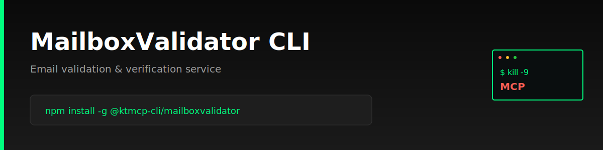

> "Six months ago, everyone was talking about MCPs. And I was like, screw MCPs. Every MCP would be better as a CLI."
>
> — [Peter Steinberger](https://twitter.com/steipete), Founder of OpenClaw
> [Watch on YouTube (~2:39:00)](https://www.youtube.com/@lexfridman) | [Lex Fridman Podcast #491](https://lexfridman.com/peter-steinberger/)

# MailboxValidator CLI

Command-line interface for MailboxValidator email validation service. Verify email addresses, detect disposable emails, and validate SMTP servers directly from your terminal.

> **⚠️ Unofficial CLI** - This tool is not officially sponsored, endorsed, or maintained by MailboxValidator. It is an independent project built on the public MailboxValidator API. Official site: https://www.mailboxvalidator.com | API docs: https://www.mailboxvalidator.com/api-email-validation

## Features

- ✉️ **Email Validation** - Full email address validation with SMTP checks
- 🚫 **Disposable Detection** - Identify temporary/disposable email addresses
- 🆓 **Free Email Detection** - Check if email is from a free provider
- 📊 **JSON Output** - Machine-readable output for scripting and automation
- ⚙️ **Easy Configuration** - Simple credential management

## Installation

```bash
npm install -g @ktmcp-cli/mailboxvalidator
```

## Configuration

```bash
# Set your API key
mailboxvalidator configure --api-key YOUR_API_KEY

# View current config
mailboxvalidator config:show
```

Configuration is stored in `~/.ktmcp/mailboxvalidator.json`

## Usage

### Full Email Validation

```bash
# Validate email address
mailboxvalidator validate user@example.com

# JSON output
mailboxvalidator validate user@example.com --json
```

### Check Free Email Providers

```bash
# Check if email is from free provider
mailboxvalidator check:free user@gmail.com

# JSON output
mailboxvalidator check:free user@gmail.com --json
```

### Check Disposable Emails

```bash
# Check if email is disposable
mailboxvalidator check:disposable temp@mailinator.com

# JSON output
mailboxvalidator check:disposable temp@mailinator.com --json
```

## Examples

### Validate Email Address
```bash
$ mailboxvalidator validate john.doe@company.com

Email Validation Results:
  Email: john.doe@company.com
  Status: Valid
  Domain: company.com
  Free Email: False
  Disposable: False
  SMTP Check: True
  MX Record: mail.company.com
```

### Detect Disposable Email
```bash
$ mailboxvalidator check:disposable temp@guerrillamail.com

Disposable Email Check:
  Email: temp@guerrillamail.com
  Disposable: Yes
```

### Batch Validation
```bash
# Validate multiple emails from a file
while read email; do
  mailboxvalidator validate "$email" --json >> results.json
done < emails.txt
```

## Use Cases

- **Form Validation** - Verify email addresses in signup forms
- **List Cleaning** - Clean email lists before sending campaigns
- **Fraud Prevention** - Detect disposable emails in user registrations
- **CRM Integration** - Validate contacts before importing
- **Email Marketing** - Improve deliverability by validating lists

## API Documentation

- [MailboxValidator API](https://www.mailboxvalidator.com/api-email-validation)
- [Single Email Validation](https://www.mailboxvalidator.com/api-single-validation)
- [Free Email Detection](https://www.mailboxvalidator.com/api-email-free)

## Authentication

Get your API key from [MailboxValidator](https://www.mailboxvalidator.com/plans).

## License

MIT

---

Built with Commander.js • Powered by MailboxValidator
